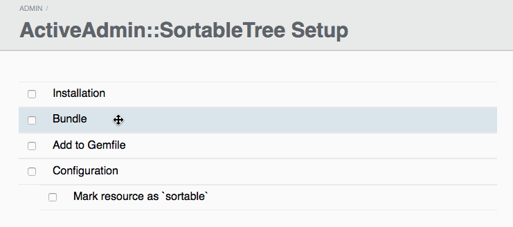

# ActiveAdmin::SortableTree

[](http://badge.fury.io/rb/active_admin-sortable_tree)
[](https://travis-ci.org/zorab47/active_admin-sortable_tree)

This gem adds a tree and a list view to your ActiveAdmin resource index, both
sortable via drag'n'drop.



## Installation

1. Add SortableTree to your Gemfile; then `bundle install`
    ```ruby
    gem "active_admin-sortable_tree", "~> 2.0.0"
    ```

2. Add a require to your JavaScript manifest `app/assets/javascripts/active_admin.js`

    ```javascript
    //= require active_admin/sortable
    ```

3. Add an import in your stylesheet manifest `app/assets/stylesheets/active_admin.scss`

    ```sass
    @import "active_admin/sortable";
    ```

## Usage (Tree)

**Admin**:

```ruby
# app/admin/page.rb
ActiveAdmin.register Page do
  sortable tree: true

  index :as => :sortable do
    label :title # item content
        actions
  end
end
```

**Model**: ActiveAdmin::SortableTree is agnostic to the tree implementation. All
you have to do is expose a sorting attribute and a few tree methods (`:parent`,
`:children` and `:roots`).  Let's say you use
[Ancestry](https://github.com/stefankroes/ancestry):

```ruby
class Page < ActiveRecord::Base
  attr_accessible :title, :body, :position
  has_ancestry :orphan_strategy => :rootify
end
```

You can configure these methods if you need:

```ruby
ActiveAdmin.register Page do
  sortable tree: true,
           sorting_attribute: :position,
           parent_method: :parent,
           children_method: :children,
           roots_method: :roots,
           roots_collection: proc { current_user.pages.roots }
  # …
end
```

The option `roots_collection` provides full control on how to find the root
nodes of your sortable tree and is evaluated within the context of the
controller. Please note that `roots_collection` will override what is specified
in `roots_method`.

## Usage (List)

**Admin**:

```ruby
# app/admin/page.rb
ActiveAdmin.register Page do
  sortable

  index :as => :sortable do
    label :title # item content
    actions
  end
end
```

**Model**: Sortable list assumes you have a `:position` field in your resource.
Of course it's configurable:

```ruby
ActiveAdmin.register Page do
  sortable tree: false, # default
           sorting_attribute: :my_position_field
  # …
end
```

**Note**: If you are using the [acts_as_list](https://github.com/swanandp/acts_as_list) gem to manage a `:position` field (not required, but allows for other nice programmatic manipulation of ordered model lists), you must ensure a zero-based index for your list using the `top_of_list` option:

```ruby
class Page < ActiveRecord::Base
  # Make this list act like a zero-indexed array to avoid off-by-one errors in your sorting
  acts_as_list top_of_list: 0
end
```


## Usage (generic ActiveAdmin index)

Currently supports only IndexAsBlock, more to come!

**Admin**:
```ruby
# app/admin/page.rb
ActiveAdmin.register Page do
  sortable

  index :as => :block do |page|
    # item content
  end
end
```

**Model**: Same as list view (see above)

## Customization

### Full options list with defaults

```ruby
ActiveAdmin.register Page do
  sortable tree: true,
           max_levels: 0,               # infinite indent levels
           protect_root: false,         # allow root items to be dragged
           sorting_attribute: :position,
           parent_method: :parent,
           children_method: :children,
           roots_method: :roots,
           roots_collection: nil,       # proc to specifiy retrieval of roots
           sortable: true,              # Disable sorting (use only 'tree' functionality)
           collapsible: false,          # show +/- buttons to collapse children
           start_collapsed: false,      # when collapsible, start with all roots collapsed
end
```


### Actions

In `IndexAsSortable` you can add custom actions (with or without the defaults):

```ruby
index :as => :sortable do
  actions defaults: false do |page|
    link_to "Custom action", my_custom_path(page)
  end
end
```

### Ajax Callback Config

It exposes three Ajax Events: ajaxDone, ajaxFail and ajaxAlways, which
correspond to jQuery ajax callbacks: done, fail and always.

To subscribe Ajax callback:

```javascript
ActiveAdminSortableEvent.add('ajaxDone', function (){
  // do what you want
})
```

### Upgrading to SortableTree 2.0 from 1.0

Upgrading from SortableTree 1.x requires manually specifying assets in your
`app/assets/javascripts/active_admin.js` and `app/assets/stylesheets/active_admin.scss`
files.


### Dependencies

ActiveAdmin::SortableTree 2.0 supports ActiveAdmin 1.0.0+. For previous versions
of ActiveAdmin use older SortableTree versions from the 1.x branch.

Note: If you experience issues with drag and drop capability, you may need to
specify the version for your ActiveAdmin installation. It is reported working
using v0.6.6, or if you are using v1.0.0.pre, it is reported working on this
commit [b3a9f4b](https://github.com/activeadmin/activeadmin/commit/b3a9f4b3e4051447d011c59649a73f876989a199)
or later.

```ruby
# Gemfile
gem 'activeadmin', github: 'activeadmin', ref: 'b3a9f4b'
```

## Semantic Versioning

ActiveAdmin::SortableTree follows [semantic versioning](http://semver.org).

## Alternatives

- [Active Admin Sortable](https://github.com/neo/activeadmin-sortable)

## Copyright

Copyright © 2013 Francesco Disperati, Cantiere Creativo. See the file
MIT-LICENSE for details. See the full list list of
[contributors](http://github.com/zorab47/active_admin-sortable_tree/graphs/contributors).
